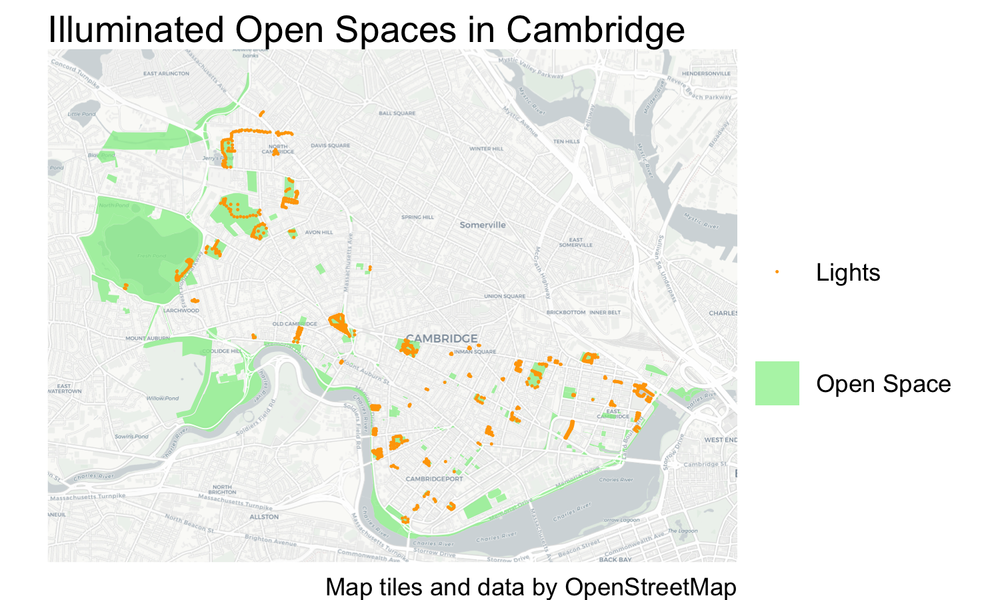
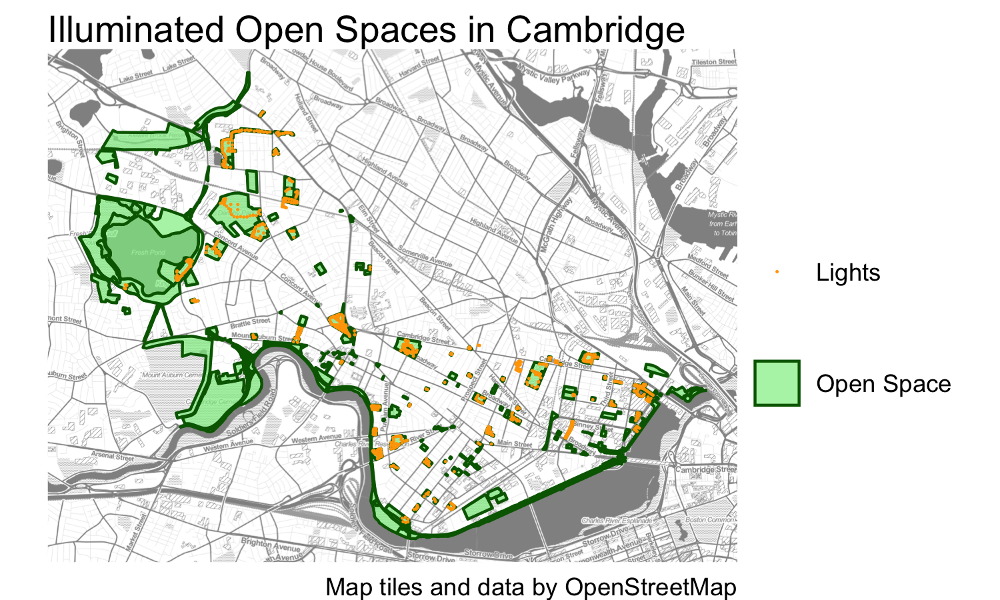
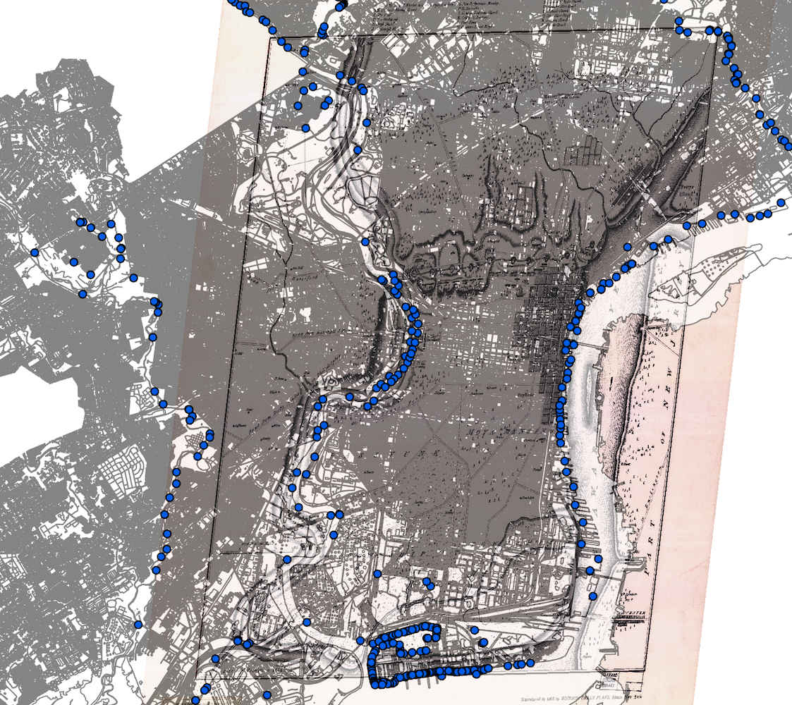
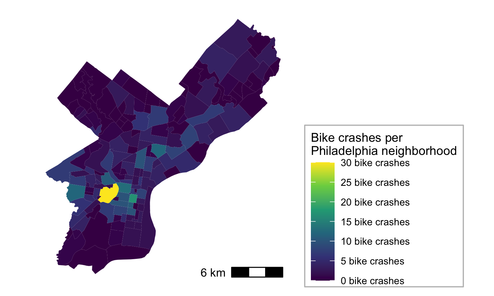
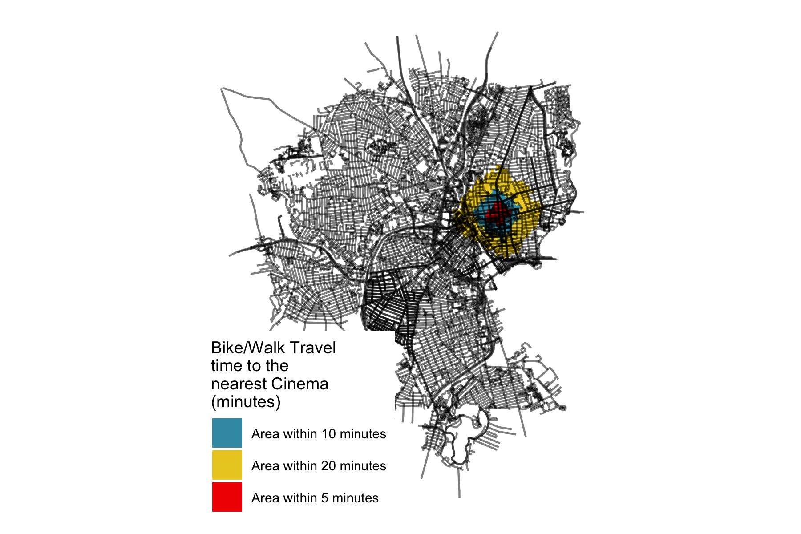
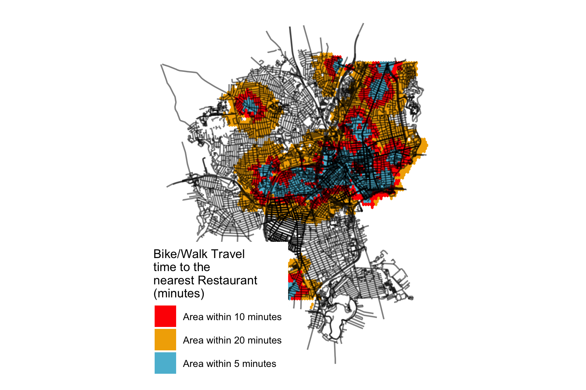
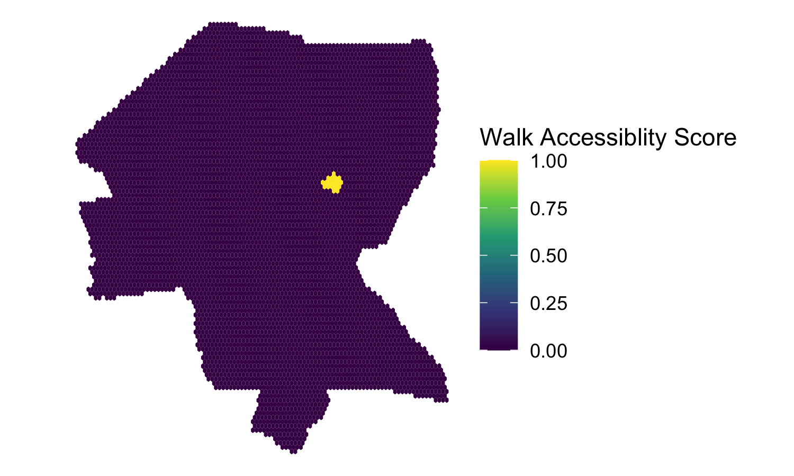
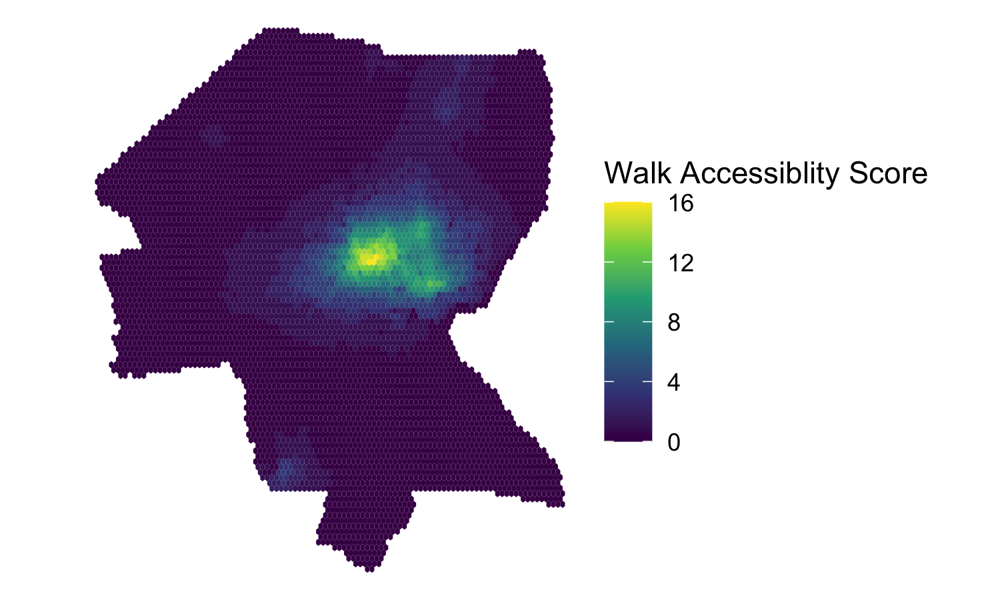
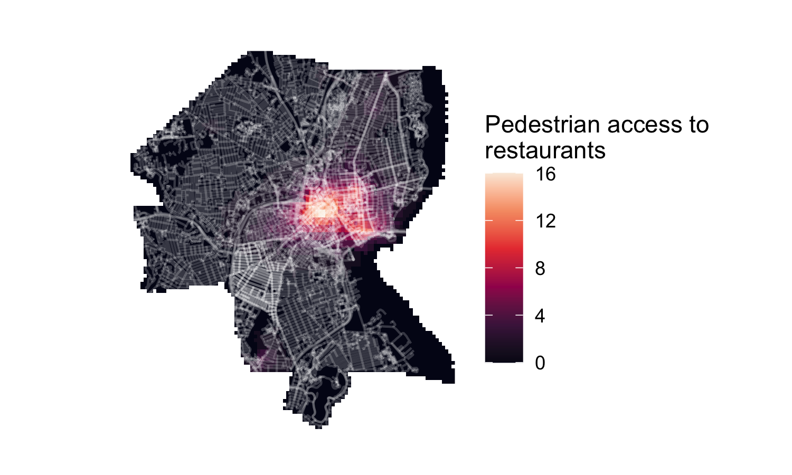
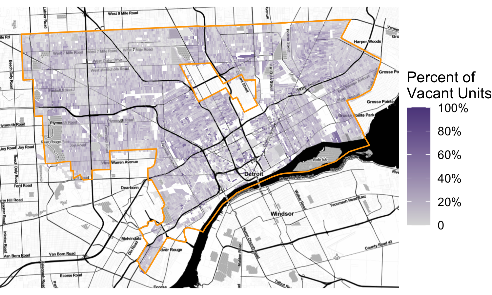

```{r setup, include=FALSE}
knitr::opts_chunk$set(echo = TRUE)
```

This semester in VIS 2128 we explored multiple topics related to spatial analysis in R and R Studio. Over 7 weeks, we covered the modules listed below. The following work demonstrates the material of each module and its associated learnings to show the synthesis of skill-sets acquired throughout the course.

Modules Covered:

* Displaying Data
* Visualizing Places
* Spatial Relationships
* Routes and Networks
* Raster Data
* Interactive Maps


# Displaying Data
These two maps compare open space and park lights in Cambridge, MA. My group and I selected these data layers to explore how well-lit the city's open spaces and parks are and how that may contribute to a resident's sense of safety and accessibility to those spaces at night. Skills used:

* Displaying multiple vector layers on the same map

[](https://awittet.github.io/portfolio/fullsize/illuminated-open-spac2.pdf){target="_blank"}

[](https://awittet.github.io/portfolio/fullsize/illuminated-open-spac.pdf){target="_blank"}


# Visualizing Places through Georeferencing
This map was created by georeferencing a historic map of Philadelphia from 1779 in ArcGIS. It documents the extent of impervious surfaces within the modern city as well as the locations of municipal stormwater outfalls (displayed as blue dots). It demonstrates the following skills: 

* Georeferencing a raster image
* Displaying multiple vector layers on the same map

[](https://awittet.github.io/portfolio/fullsize/Philly-imperv-outfalls-Map.pdf){target="_blank"}

# Spatial Relationships
This series of maps shows the relationship between bike crashes and different neighborhoods in Philadelphia. The first map aggregates the number of bike crashes in each Philadelphia neighborhood. The second map shows the density of bike crashes per square mile in each neighborhood. They demonstrate the following skills:

* Aggregating point data to a layer of polygons
* Calculating and displaying relationships among point and polygon layers based on distance


[](https://awittet.github.io/portfolio/fullsize/crashes-by-neigh.pdf){target="_blank"}
[](https://awittet.github.io/portfolio/fullsize/crash-density.pdf){target="_blank"}

# Routes and Networks
These maps demonstrate travel times to the nearest restaurant and cinema in Providence, RI. Isochrones are used to show the area that can be reached within 5, 10, and 20 minute cutoff travel times. Both maps show travel time for biking or walking. Skills demonstrated:

* Displaying multiple vector layers on the same map
* Calculating and displaying accessibility, based on travel time

#### Cinema
[](https://awittet.github.io/portfolio/fullsize/isochr-cinema2.pdf){target="_blank"}

#### Restaurants
[](https://awittet.github.io/portfolio/fullsize/isochr-rest.pdf){target="_blank"}

# Accessibility
These two maps show accessibility based on an exponential distance-decay function of the walking time to the nearest cinema and restaurant in Providence, RI. Both maps were converted from a polygon layer to a raster layer. They demonstrate the following skills:

* Calculating and displaying accessibility, based on travel time
* Displaying raster data on a map

#### Cinema
[](https://awittet.github.io/portfolio/fullsize/cinema_access.pdf){target="_blank"}

#### Restuarants 
[](https://awittet.github.io/portfolio//fullsize/restaur_access.pdf){target="_blank"}

# Converting from Raster to Vector Layers
These maps demonstrate a raster layer converted to a vector layer. The the previous set of maps, they display accessibility based on an exponential distance-decay function of the walking time to the nearest restaurant in Providence, RI. They show the number of restaurants a pedestrian can access by walking from a specific point. The second map displays this relationship using contours. Skills demonstrated:

* Calculating and displaying accessibility, based on travel time
* Displaying raster data on a map
* Converting between raster layers and vector layers


#### Raster Layer
[](https://awittet.github.io/portfolio/fullsize/restaur_rasterplot.pdf){target="_blank"}

#### Vector Layer
[](https://awittet.github.io/portfolio/fullsize/restaur_rastervector.pdf){target="_blank"}

# Interactive Maps
This map shows the unit vacancy rate for Detroit Michigan in context to the greater Wayne County. It includes the total units, units occupied, and units vacant per census block parcel. The pop-ups indicate the percent of vacancy per block. The following skills are demonstrated:

* Displaying data on an interactive map


### Unit Vacancy in Detroit, Michigan 
[](https://awittet.github.io/portfolio/fullsize/AWittet_Assignment6_Detroit_vacant_units.html){target="_blank"}


