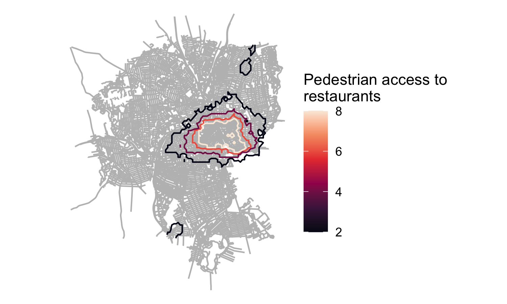

```{r setup, include=FALSE}
knitr::opts_chunk$set(echo = TRUE)
```

Your portfolio should demonstrate each of the following skills (not all of which are demonstrated in this example):

* Displaying multiple vector layers on the same map
* Calculating and displaying relationships among point and polygon layers based on distance
* Aggregating point data to a layer of polygons
* Calculating and displaying accessibility, based on travel time
* Converting between raster layers and vector layers
* Displaying raster data on a map
* Georeferencing a raster image
* Displaying data on an interactive map

This semester in VIS 2128 we explored multiple topics related to spatial analysis in R and R Studio. Over 7 weeks, we covered the following modules. The following work walks through each week's module and associated learnings to show the synthesis of multiple skill-sets acquired throughout the course.


# Displaying Data
Here are maps of Cambridge that display open space and lights. We selected these data layers to explore how accessable Cambridge's open spaces may be at night from a safety point of view. Skills used:

* Displaying multiple vector layers on the same map

[](https://awittet.github.io/portfolio/fullsize/illuminated-open-spac2.pdf){target="_blank"}

[](https://awittet.github.io/portfolio/fullsize/illuminated-open-spac.pdf){target="_blank"}


## Visualizing Places
These maps were geo-referenced from a map of Philadelphia from 1779. They document the spread of impervious surfaces within the modern city as well as the locations of stormwater outfalls. This georeferenced map demonstrates the following skills: 

* Georeferencing a raster image

[](https://awittet.github.io/portfolio/fullsize/Philly-imperv-outfalls-Map.pdf){target="_blank"}

## Spatial Relationships
This series of maps shows different relationships between bike share stations and bike crashes in Philadelphia. They demonstrate the following skills:

* Calculating and displaying relationships among point and polygon layers based on distance
* Aggregating point data to a layer of polygons

[](https://awittet.github.io/portfolio/fullsize/crashes-by-neigh.pdf){target="_blank"}
[](https://awittet.github.io/portfolio/fullsize/crash-density.pdf){target="_blank"}

## Routes and Networks / Isochrones
These maps demonstrate travel time to nearest restaurants and cinemas in Providence, RI. It calculates travel time for walking and biking. The following skills are demonstrated:

* Displaying multiple vector layers on the same map
* Calculating and displaying accessibility, based on travel time

[](https://awittet.github.io/portfolio/fullsize/isochr-cinema.pdf){target="_blank"}
[](https://awittet.github.io/portfolio/fullsize/isochr-rest.pdf){target="_blank"}

## Accessibility
This map shows accessibility based on a distance-decay function of the walking time to the nearest restuarant in Providence, RI. It demonstrates the following skills:

* Calculating and displaying accessibility, based on travel time
* Displaying raster data on a map
* Converting between raster layers and vector layers

[](https://awittet.github.io/portfolio/fullsize/cinema_access.pdf){target="_blank"}
[](https://awittet.github.io/portfolio//fullsize/restaur-access.pdf){target="_blank"}

Rasters
[](https://awittet.github.io/portfolio/fullsize/restaur_rasterplot.pdf){target="_blank"}
[](https://awittet.github.io/portfolio/fullsize/restaur-rastervector.pdf){target="_blank"}

## Interactive Maps
This map shows the unit vacancy rate for Detroit Michigan in context to the greater Wayne County. It includes the total units, units occupied, and units vacant per census block parcel. The pop-ups indicate the percent of vacancy per block. Skills demonstrated:

* Displaying data on an interactive map

[](https://awittet.github.io/portfolio/fullsize/AWittet_Assignment6_Detroit_vacant_units.html){target="_blank"}


